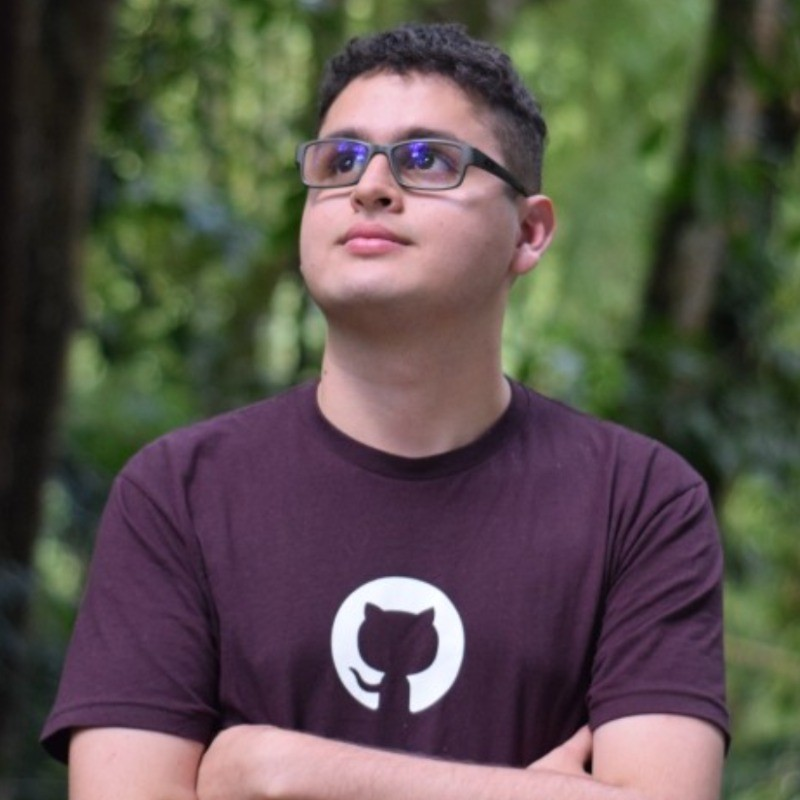

# 🧠 NeuroRelay — Offline SSVEP Brain‑to‑Agent

> **Gaze → Intention → Local Agent.**  
> A privacy‑first, audit‑friendly interface that turns **eye fixation** into **four useful actions** on your local documents — **no internet required**.

**🏆 Built for the OpenAI Open Model Hackathon**  
*Categories: Best Local Agent • For Humanity • Weirdest Hardware*

---

## 🌟 Why NeuroRelay Matters

Computers speak fast; we don't. Human→machine **bandwidth is tiny**—and for people who can't use hands or voice, it's often **near zero**. 

NeuroRelay bridges this gap with a reliable four‑choice control loop: **look at a tile → we detect the frequency your brain echoes → a local agent does the work**. Everything happens **offline**, with **clear neurofeedback** and **full audit trails**.

### 🔬 SSVEP in 30 seconds
**SSVEP = Steady‑State Visual Evoked Potentials.** When you fixate a **flickering tile** (e.g., 10 Hz), your visual cortex echoes that rhythm. With each tile flickering at a **different frequency**, we can tell **which one you're looking at** by analyzing EEG from occipital sensors (O1, Oz, O2) using **CCA**.

---

## 🎯 What It Does

**Clean 2×2 interface with four large choices:**

| 🆘 **HELP** | 📖 **READ** |
|-------------|-------------|
| Large‑print overlay for caregivers | Concise summary ready for TTS |

| 📋 **PLAN** | 💬 **MESSAGE** |
|-------------|----------------|
| Step‑by‑step plans or extracted TODOs | Short, friendly draft messages |

**Everything is auditable**: UI emits **BrainBus JSON** with decisions & confidence; agent writes artifacts to `workspace/out/` and logs to `logs/agent.jsonl`.

---

## ⚡ Quick Start

```bash
# 1️⃣ Install dependencies
uv venv
uv sync -E ui -E stream -E agent

# 2️⃣ Add a test document
mkdir -p workspace/in
cp examples/demo.md workspace/in/

# 3️⃣ Launch in simulation mode (no EEG needed!)
uv run neurorelay-ui --fullscreen

# Use arrow keys or 1-4 to test selections
# Outputs appear in workspace/out/
```

**📁 Outputs:** `*_summary.md`, `*_todos.md`, `*_deadlines.md` (+ `.ics`), `draft_*.md`

---

## 🔧 Installation & Setup

### Requirements
- **Python 3.11+**
- **OS:** Linux/macOS/Windows *(Linux recommended for live demos)*
- **Optional:** LM Studio for enhanced AI responses

### Installation
```bash
uv venv
uv sync -E ui -E stream -E agent
```

### Optional: Local LLM Setup
```bash
export NEURORELAY_GPT_MODEL="openai/gpt-oss-20b"
export NEURORELAY_LMSTUDIO_URL="http://localhost:1234/v1"
export NEURORELAY_LLM_TIMEOUT="30"
```

---

## 🚀 Running NeuroRelay

### 🎮 Mode 1: Simulation (Recommended for demos)
Perfect for showcasing without EEG hardware:
```bash
uv run neurorelay-ui --fullscreen
```

### 🌊 Mode 2: Synthetic LSL (Live-like experience)
Adds realistic timing with synthetic EEG over LSL:
```bash
# Terminal 1: Start synthetic EEG stream
uv run python scripts/synth_to_lsl.py --sr 250 --freqs "8.57,10,12,15" &

# Terminal 2: Run UI with live decoder
uv run neurorelay-ui --live --prediction-rate 4 --fullscreen
```

### 🧠 Mode 3: Live EEG (Real brain signals)
For actual brain-computer interface:
```bash
# Ensure your EEG acquisition streams to LSL (type=EEG, channels: O1, Oz, O2)
uv run neurorelay-ui --live --fullscreen
```

---

## 🎛️ Controls & Interface

### Keyboard Shortcuts
| Key | Action |
|-----|--------|
| **SPACE** | Pause/Resume |
| **ESC** | Exit |
| **H** | Toggle HUD |
| **F11** | Fullscreen |
| **A** | Agent dock |
| **P** | Center panel |

### Simulation Controls
| Input | Selection |
|-------|-----------|
| **←/↑/1** | 🆘 HELP |
| **→/2** | 📖 READ |
| **↓/3** | 📋 PLAN |
| **4** | 💬 MESSAGE |

---

## 🤖 Agent Capabilities

The agent runs **completely offline**, reading from `workspace/in/` and writing to `workspace/out/`:

### 🛠️ Available Tools

| Tool | Output | Description |
|------|--------|-------------|
| **🆘 HELP** | `HELP_<timestamp>.md` + overlay | Large-print assistance for caregivers |
| **📖 READ** | `<file>_read_<timestamp>.md` | Concise summary with TTS support |
| **📋 PLAN** | `<file>_plan.md` | Step-by-step plans or extracted TODOs |
| **💬 MESSAGE** | `draft_<timestamp>.md` | Short, friendly message drafts |

### 🧠 AI Integration
- **With LM Studio:** Uses local **gpt-oss-20b/120b** for intelligent responses
- **Without LM Studio:** Falls back to **deterministic heuristics**
- **Always safe:** Draft-only, never sends or modifies original files

---

## ⚙️ Configuration

Key settings in `config/default.json`:

```json
{
  "monitor_hz": 120,
  "freqs_hz": [8.57, 10.0, 12.0, 15.0],
  "window_sec": 3.0,
  "dwell_sec": 1.2,
  "tau": 0.65,
  "channels": ["O1", "Oz", "O2"],
  "flicker_mode": "sinusoidal"
}
```

**🔧 Pro tip:** Use `--auto-freqs` to automatically adapt frequencies to your monitor refresh rate.

---

## 🔬 Technical Deep Dive

### SSVEP Pipeline
1. **📺 Stimuli:** 4 unique flicker frequencies (sinusoidal contrast)
2. **🔄 Preprocessing:** Band-pass 5–40 Hz, optional 50/60 Hz notch
3. **🧮 Decoder:** CCA with sine/cosine references at 1×f & 2×f
4. **⏱️ Timing:** ~3.5–4.0s stimulus→action (3s window + processing + dwell)
5. **📊 Performance:** ~23–33 bits/min ITR (85-95% accuracy)

### Data Flow
```
EEG → LSL → Preprocessing → CCA → Confidence → Dwell → Agent → Output
```

---

## 📊 Logs & Auditability

| File | Content |
|------|---------|
| `logs/agent.jsonl` | Agent events & decisions |
| `logs/brainbus_*.jsonl` | Brain signal analysis |
| `workspace/out/` | Generated outputs |
| `workspace/in/` | Input documents |

Every selection creates a **timestamped JSON record** with method, scores, chosen label, and confidence.

---

## 🔐 Privacy & Security

### 🏠 Fully Offline
- ✅ **No internet required**
- ✅ **Local LLM only** (LM Studio)
- ✅ **Sandboxed file access**
- ✅ **Draft-only actions**

### 🛡️ Safe by Design
- Reads **only** from `workspace/in/`
- Writes **only** to `workspace/out/`
- Never modifies input files
- Never sends emails or network requests

---

## 🛠️ Diagnostic Tools

### Live EEG Testing
```bash
uv run neurorelay-stream-demo \
  --stream-type EEG \
  --freqs "8.57,10,12,15" \
  --window 3.0 --step 0.5 \
  --bandpass 5,40 --notch 60 \
  --method cca -v
```

### Synthetic Data Generation
```bash
uv run neurorelay-gen-synth \
  --out data/sim_session.csv \
  --sr 250 --monitor-hz 60 --seed 42
```

---

## 🩹 Troubleshooting

| Issue | Solution |
|-------|----------|
| **No flicker visible** | Use fullscreen; check `monitor_hz`; try `--auto-freqs` |
| **"No data" in live mode** | Verify LSL EEG stream; test with `neurorelay-stream-demo` |
| **"No input document"** | Add `.md/.txt/.pdf/.docx` to `workspace/in/` |
| **Generic responses** | Start LM Studio; check connection; heuristics are fallback |
| **Filter errors** | Increase `window_sec`; ensure filters below Nyquist |

---

## 🏆 Hackathon Fit

### 🥇 Best Local Agent
- **Fully offline** agent with gpt-oss integration
- **Auditable** JSONL logs for transparency
- **Safe** draft-only operations

### 🌍 For Humanity
- **Accessibility-first** hands-free control
- **Reproducible** with simulated EEG
- **Privacy-preserving** local processing

### 🤖 Weirdest Hardware (Spirit)
- **Brain rhythms** as direct input
- **Neural feedback** loops
- **Biometric → reasoning** pipeline

---

## 🗺️ Future Roadmap

- 🎯 **Personalization:** FBCCA/TRCA calibration
- ✅ **Hybrid confirmation:** SSVEP + P300
- 📱 **Extended layouts:** 6-8 options with adaptive UI
- 🦾 **Assistive integration:** AR/VR, wheelchairs, robots
- 🌐 **Multilingual:** TTS and interface localization

---

## 🛠️ Built With

**Core:** Python 3.11 • PySide6/Qt • NumPy • SciPy  
**Streaming:** pylsl • libLS
* Use **Fullscreen** (`--fullscreen` or press **F11**).
* Set `monitor_hz` correctly in `config/default.json`.
* Consider `--auto-freqs` so frequencies match your refresh rate (e.g., 60 Hz → 8.57/10/12/15 Hz).

**Live label says “no data”.**

* Make sure an LSL EEG stream is running (`type=EEG`).
* Try `uv run neurorelay-stream-demo` to verify.
* If you use a specific stream name, pass `--lsl-name <name>`.
* Check that the sample rate is reasonable (≥ 100 Hz recommended).

**Agent says “no input document found”.**

* Place a `.md/.txt/.pdf/.docx` in `workspace/in/`.
* The most recent file is used automatically.

**Summaries/emails look generic.**

* Ensure LM Studio is running (`NEURORELAY_LMSTUDIO_URL` points to it, model is loaded).
* If an LLM isn’t available, we intentionally produce conservative heuristic outputs.

**Filter padding errors / detection unstable.**

* Increase `window_sec` (e.g., 3.0 → 3.5) to satisfy filter padding.
* Confirm `bandpass_hz` and `notch_hz` are below Nyquist (sample\_rate/2).

**“Failed to start neurorelay-agent”.**

* Make sure `uv sync -E agent` was run (for PDF/DOCX & LLM client libs).
* Check `logs/agent.jsonl` and console output.

**“Open” button doesn’t open the file.**

* On some platforms, `xdg-open` may not be available. Open the path shown in the UI manually from `workspace/out/`.

---

## Security & Offline Model

* **Sandboxed I/O**: The agent reads **only** from `workspace/in/` and writes **only** to `workspace/out/`.
* **No network required**: LM Studio is optional. Without it, the agent uses deterministic local heuristics.
* **Non‑destructive**: The agent creates new files; it never modifies inputs.

---

## Command Cheat Sheet

```bash
# Install
uv venv
uv sync -E ui -E stream -E agent

# UI: simulation (no EEG)
uv run neurorelay-ui

# UI: live (LSL)
uv run neurorelay-ui --live --fullscreen

# UI: adapt freqs to monitor refresh
uv run neurorelay-ui --auto-freqs

# Console: live SSVEP (diagnostics)
uv run neurorelay-stream-demo -v

# Generate synthetic CSV
uv run neurorelay-gen-synth --out data/sim_session.csv --monitor-hz 120 --freqs auto
```

---

## What to Expect in a Demo

1. **Launch UI** (simulation first).
2. Drop a sample doc into `workspace/in/`.
3. Simulate a selection (arrow keys / 1..4).
4. Watch the **Agent** label change to `pending…`, then `→ <output_path>`.
5. Find your file in `workspace/out/`.
6. (If live) Enable `--live`, confirm the link dot turns **green**, then fixate a tile until the dwell ring completes to commit.

---

## Team

Meet the people behind NeuroRelay. Click a photo or name to open LinkedIn.

<!-- markdownlint-disable MD033 -->
<div align="center">

<table>
  <tr>
    <td align="center" width="33%">
      <a href="https://www.linkedin.com/in/josejaramillov/">
        
      </a>
      <br/>
      <a href="https://www.linkedin.com/in/josejaramillov/"><strong>Jose Alfredo Jaramillo</strong></a>
    </td>
    <td align="center" width="33%">
      <a href="https://www.linkedin.com/in/rosario-iodice-49633880/">
        
      </a>
      <br/>
      <a href="https://www.linkedin.com/in/rosario-iodice-49633880/"><strong>Rosario Iodice</strong></a>
    </td>
    <td align="center" width="33%">
      <a href="https://www.linkedin.com/in/jose-felipe-duarte">
        
      </a>
      <br/>
      <a href="https://www.linkedin.com/in/jose-felipe-duarte"><strong>Jose Felipe Duarte</strong></a>
    </td>
  </tr>
</table>

</div>
<!-- markdownlint-enable MD033 -->

### Partner Universities

<!-- markdownlint-disable MD033 -->
<p align="center">
  
  &nbsp;&nbsp;&nbsp;&nbsp;
  
</p>
<!-- markdownlint-enable MD033 -->

